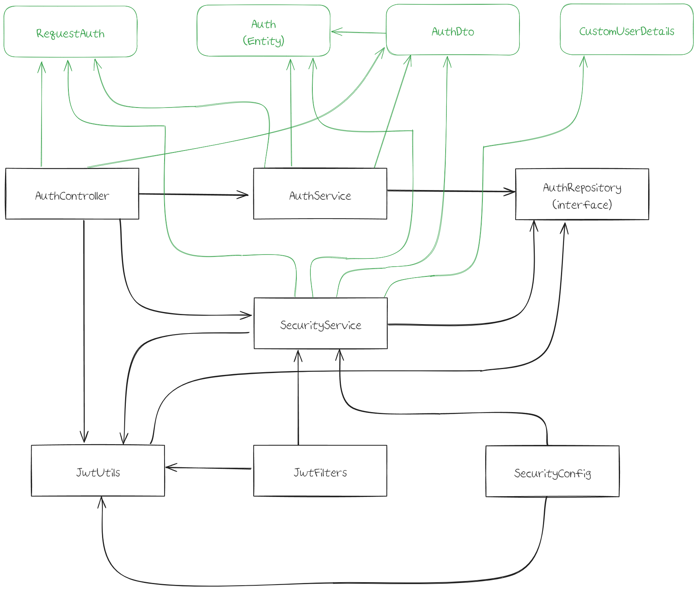
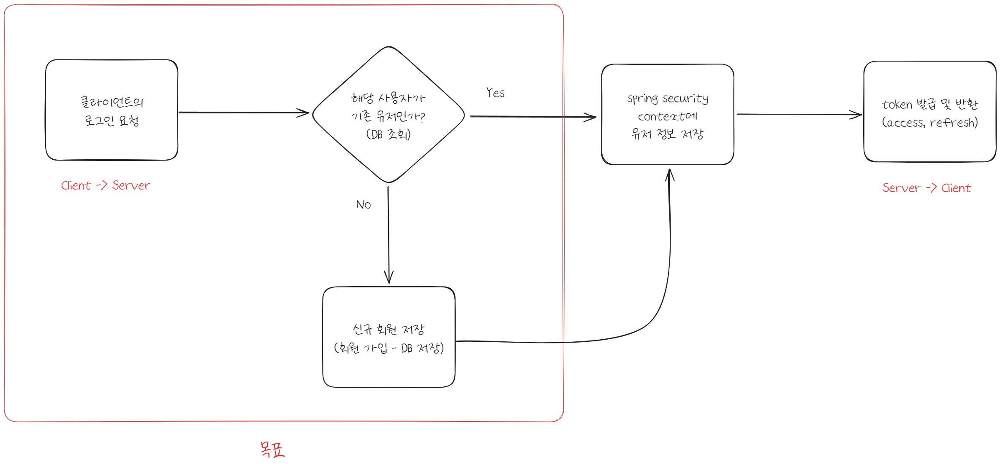
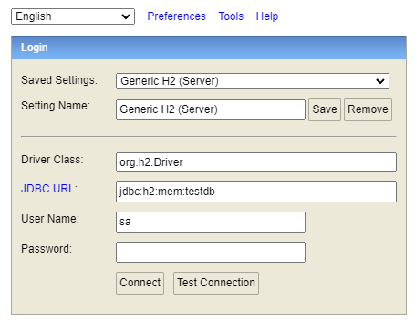
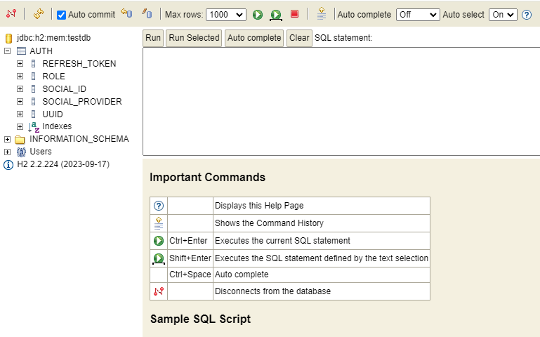
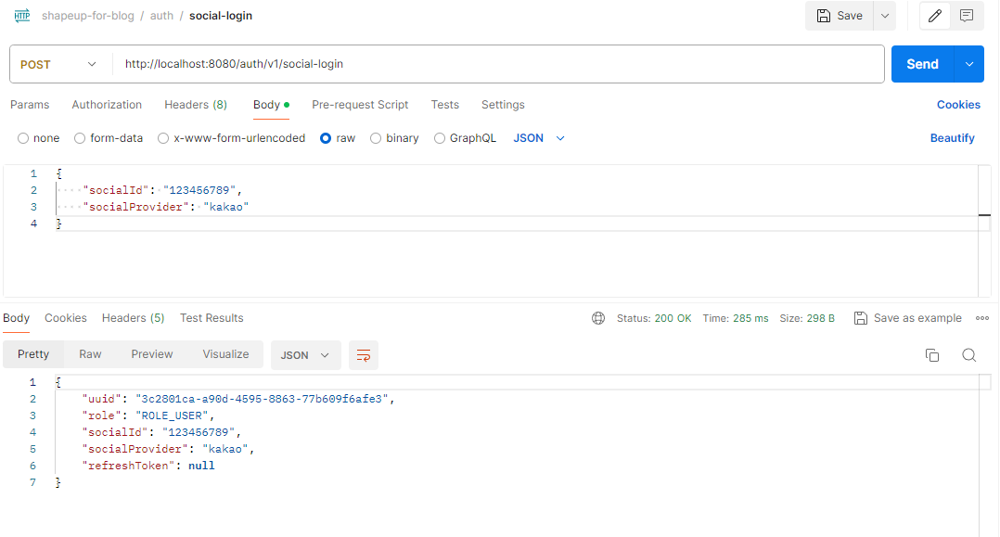
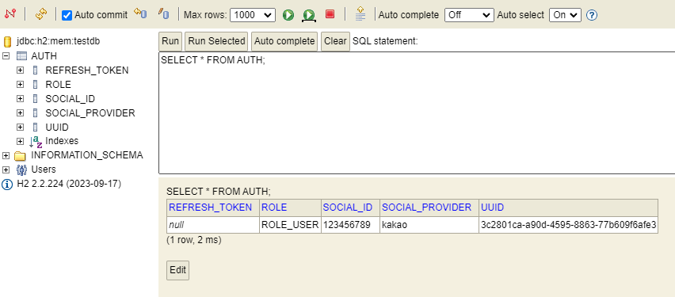

## 목표

<b>[참고 깃헙 링크](https://github.com/hxnsxxm/shapeup-for-blog)</b>  

<br>

이번에는 [저번 게시물 - Flutter와 Spring Security로 로그인 구현하기 - 01 (with JWT)](https://hxnsxxm.github.io/develop/shapeup/flutter%EC%99%80springsecurity%EC%97%B0%EB%8F%99%ED%95%98%EC%97%AC%EB%A1%9C%EA%B7%B8%EC%9D%B8%EA%B5%AC%ED%98%8401)에서 
정리한 클래스들의 역할과 코드를 정리해보겠습니다.  

단계는 크게 3가지로 나누려고 합니다.  

1. <b>로그인 요청 시 정보 조회 및 신규 회원이면 저장</b>
2. Security context 등록 및 토큰 발급 후 응답 반환
3. 필터 설정 및 테스트

먼저 <b>1. 로그인 요청 시 정보 조회 및 신규 회원이면 저장</b>을 작성해 보겠습니다.  

<br>

이전 게시물에서 마지막으로 <b>클래스간 의존 관계</b>의 아키텍처 그림을 그려보았습니다.  

거기에서 조금 더 추가한 그림을 다시 그려보겠습니다.  



<br>

### 서버 동작

목표로 하는 동작은 아래 그림의 빨간 테두리로 표시한 부분입니다.



#### 요청 본문

| 이름             | 타입     | 설명                      | 필수 |
|----------------|--------|-------------------------|----|
| socialId       | String | 소셜 로그인 서비스에서 제공하는 고유 ID | O  |
| socialProvider | String | 소셜 로그인 서비스              | O  |

<b>요청 예제</b>

```json
POST http://localhost:8080/auth/v1/social-login

body
{
    "socialId": "123456789",
    "socialProvider": "kakao"
}
```

<br>

#### 응답 본문

실제로는 토큰을 반환해야 하지만, 정상적으로 회원 정보가 저장되는지 확인하는 용도로만 데이터를 받겠습니다.  

| 이름             | 타입     | 설명            | 필수 |
|----------------|--------|---------------|----|
| uuid           | String |   | O  |
| role           | String |  | O  |
| socialId       | String |               | O  |
| socialProvider | String |               | O  |

<b>응답 예제</b>

```json
{
    "uuid" : "3c2001ca-a90d-4783-4023-88v50fbafe2",
    "role" : "ROLE_USER",
    "socialId" : "123456789",
    "socialProvider" : "kakao",
    "refreshToken" : null
}
```

<br>

## 클래스의 역할과 코드

### build.gradle

```gradle
dependencies {
    implementation 'org.springframework.boot:spring-boot-starter-web'
    compileOnly 'org.projectlombok:lombok'
    developmentOnly 'org.springframework.boot:spring-boot-devtools'
    annotationProcessor 'org.projectlombok:lombok'
    testImplementation 'org.springframework.boot:spring-boot-starter-test'

    // jpa
    implementation 'org.springframework.boot:spring-boot-starter-data-jpa'
    // H2
    runtimeOnly 'com.h2database:h2'
}

tasks.named('test') {
    useJUnitPlatform()
}
```

<br>

### application.yml

```yaml
server:
  port: 8080

spring:
  datasource:
    # H2 인메모리 데이터베이스를 사용하는 경우
    url: jdbc:h2:mem:testdb
    #url: jdbc:h2:tcp://localhost/~/test
    driver-class-name: org.h2.Driver
    username: sa
    password:
  jpa:
    properties:
      hibernate:
        show_sql: true
        format_sql: true
        use_sql_comments: true
    # H2 데이터베이스용 Hibernate dialect(JPA가 사용할 데이터베이스 플랫폼을 지정한다)
    database-platform: org.hibernate.dialect.H2Dialect
    # 애플리케이션 시작시 엔티티 클래스를 기반으로 테이블을 생성하고, 애플리케이션 종료시 테이블을 삭제한다
    hibernate:
      ddl-auto: create-drop
      # 테이블 관련 SQL문 콘솔에 출력
      show-sql: true
      properties:
        hibernate:
          format_sql: true
      h2:
        # H2 콘솔 설정
        console:
          enabled: true
          path: /h2

  sql:
    init:
      mode: always

logging:
  level:
    org:
      hibernate:
        type:
          descriptor:
            sql: trace
```

<br>

### Auth (Entity)

<b>역할</b>

사용자의 회원가입 및 로그인 정보를 저장할 엔티티입니다.  

회원가입 시 무작위로 생성하는 `uuid`로 사용자들을 식별하고, `refreshToken`을 통해서 토큰 재발급의 유효성을 판별합니다.  

<b>코드</b>

```java
@Entity
@Getter
@Builder
@Table(name = "auth")
@NoArgsConstructor(access = AccessLevel.PROTECTED)
@AllArgsConstructor
public class Auth {

    @Id
    @Column(name = "uuid")
    private String uuid;

    @Column(name = "role")
    private String role;

    @Column(name = "social_id")
    private String socialId;

    @Column(name = "social_provider")
    private String socialProvider;

    @Column(name = "refresh_token")
    private String refreshToken;
}
```

<br>

### RequestAuth

<b>역할</b>

클라이언트의 서비스 로그인 요청 시, 같이 받을 요청 본문입니다.  

<b>코드</b>

```java
@Data
public class RequestAuth {

    /**
     * OAuth 로그인에서 제공하는 고유 ID
     * e.g. Kakao  : 123456789
     * e.g. Google : 103707946781717949594
     */
    private String socialId;
    /**
     * OAuth 로그인 경로
     */
    private String socialProvider;
}
```

<br>

### AuthDto

<b>역할</b>

`Service`에서 사용자 정보를 저장/조회 후 해당 정보를 반환하기 위한 객체입니다.

<b>코드</b>

```java
@Data
@Builder
public class AuthDto {

    private String uuid;
    private String role;
    private String socialId;
    private String socialProvider;
    private String refreshToken;
}
```

<br>

### AuthController

<b>역할</b>

클라이언트의 HTTP 요청을 받습니다. 지금은 로그인 요청만 받고 있습니다.  

<b>코드</b>

```java
@Slf4j
@RequiredArgsConstructor
@RestController
@RequestMapping("/auth")
public class AuthController {

    private final AuthService authService;

    @PostMapping("/v1/social-login")
    public ResponseEntity<AuthDto> socialLogin(@RequestBody RequestAuth requestAuth) {
        AuthDto savedOrFindUser = authService.socialLogin(requestAuth);

        return ResponseEntity.ok(savedOrFindUser);
    }
}
```

<br>

### AuthSerivce 

<b>역할</b>

서비스 로그인 요청 시, 로직을 담당하는 `Service`입니다.  

요청 본문으로 받은 사용자의 정보로 DB를 조회하여 해당 사용자가 존재하는 지 확인합니다.  

만약 없다면 새롭게 저장하게 되며, 사용자 정보를 반환합니다.  

<b>코드</b>

```java
@Service
@Slf4j
@RequiredArgsConstructor
public class AuthService {

    private final AuthRepository authRepository;

    public AuthDto socialLogin(RequestAuth requestAuth) {

        String socialId = requestAuth.getSocialId();
        String socialProvider = requestAuth.getSocialProvider();

        Auth auth;
        AuthDto authDto;

        if (!authRepository.existsBySocialIdAndSocialProvider(socialId, socialProvider)) {
            Auth newAuth = Auth.builder()
                    .uuid(UUID.randomUUID().toString())
                    .role("ROLE_USER")
                    .socialId(socialId)
                    .socialProvider(socialProvider)
                    .build();

            auth = authRepository.save(newAuth);
        } else {
            auth = authRepository.findBySocialIdAndSocialProvider(socialId, socialProvider);
        }

        authDto = AuthDto.builder()
                .uuid(auth.getUuid())
                .role(auth.getRole())
                .socialId(auth.getSocialId())
                .socialProvider(auth.getSocialProvider())
                .build();

        return authDto;
    }
}
```

<br>

### AuthRepository

<b>역할</b>

`Auth (Entity)`로 DB에 접근하는 메소드들을 사용하기 위한 인터페이스입니다.  

지금은 로그인 요청 시 요청 본문의 정보로 사용자 조회와 존재 여부를 확인하는 메서드만 있습니다.  

<b>코드</b>

```java
@Repository
public interface AuthRepository extends JpaRepository<Auth, String> {

    Auth findBySocialIdAndSocialProvider(String socialId, String socialProvider);
    Boolean existsBySocialIdAndSocialProvider(String socialId, String socialProvider);
}
```

<br>

## 동작 확인

위에서 작성한 코드와 목표로 하는 기능인 로그인 요청 시 정보 조회 및 신규 회원이면 저장이 
정상적으로 동작하는 지 Postman으로 확인해보겠습니다.  

<br>

### H2 연결 확인

먼저 임시 데이터베이스로 사용하는 h2가 정상적으로 연결되고, 테이블(`Auth`)가 생성되었는지 확인하겠습니다.  

```java
http://localhost:8080/h2-console
```

프로젝트 실행 후 위의 경로로 접근하면 다음과 같은 화면이 나옵니다.  



Connect를 클릭하면 다음 화면으로 넘어가고 좌측의 `AUTH`를 확인할 수 있습니다.  



<br>

### Postman으로 동작 확인

```java
POST http://localhost:8080/auth/v1/social-login

body
{
    "socialId": "123456789",
    "socialProvider": "kakao"
}
```



정상적으로 사용자 정보가 응답 본문으로 반환되는 것을 확인할 수 있습니다.  

또한, h2도 확인해보면 다음과 같습니다.  



<br>

## 다음으로

이번에는 로그인 기능 중에서 <b>1. 로그인 요청 시 정보 조회 및 신규 회원이면 저장</b>하는 동작에 대한 코드와 
postman 테스트를 진행해보았습니다.  

다음에는 <b>2. Security context 등록 및 토큰 발급 후 응답 반환</b> 동작에 대해서 작성해보도록 하겠습니다. 감사합니다.  


<hr>
<b>Reference</b>  
[spring boot와 flutter를 연동한 소셜로그인 구현(feat. spring security)-1](https://velog.io/@kgb/spring-boot%EC%99%80-flutter%EB%A5%BC-%EC%97%B0%EB%8F%99%ED%95%9C-%EC%86%8C%EC%85%9C%EB%A1%9C%EA%B7%B8%EC%9D%B8-%EA%B5%AC%ED%98%84feat.-spring-security)
